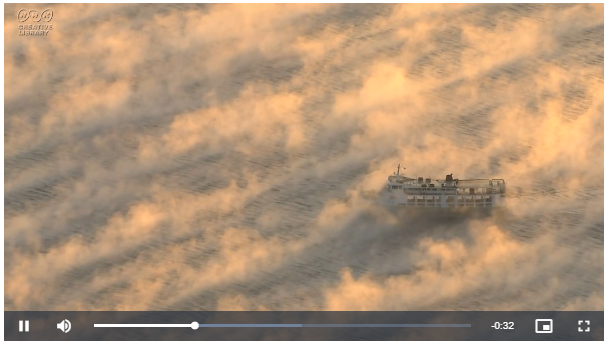
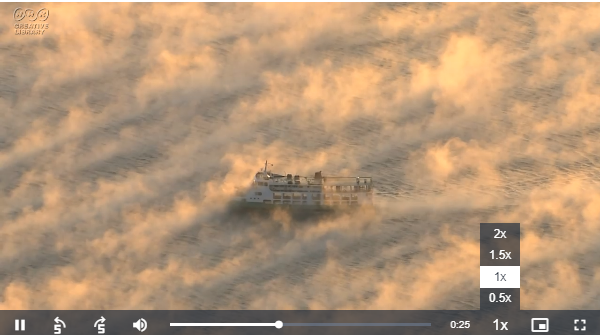
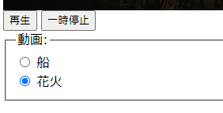
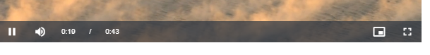

# Video.jsサンプル

ローカルで簡易webサーバーを起動して各サンプルを表示してください
```
npm install
npx http-server .
```
 動画は<a href="https://www.nhk.or.jp/archives/creative/">ＮＨＫクリエイティブ･ライブラリー</a>の素材を利用しています

## 1 最小限のサンプル(video-1-min.html)



```html
<!-- 最小限のサンプル -->
<!DOCTYPE html>
<html lang="ja">
  <head>
    <meta charset="UTF-8">
    <title>最小限のサンプル</title>
    <link href="https://vjs.zencdn.net/8.16.1/video-js.css" rel="stylesheet" />
    <script src="https://vjs.zencdn.net/8.16.1/video.min.js"></script>
  </head>
  <body>
    <video-js id="vid1" data-setup='{"width":"600px;"}' controls>
      <source src="ship-in-fog.mp4">
    </video-js>
  </body>
</html>
```

## 2 初期化オプション設定(video-2-option.html)



```html
<!-- 初期化オプション設定 -->
<!DOCTYPE html>
<html lang="ja">
<head>
  <meta charset="UTF-8">
  <title>初期化オプション設定</title>
  <link href="https://vjs.zencdn.net/8.16.1/video-js.css" rel="stylesheet" />
</head>
<body>
  <video id="video1" class="video-js">
    <source src="ship-in-fog.mp4" type="video/mp4">
  </video>
  <script src="https://vjs.zencdn.net/8.16.1/video.min.js"></script>
  <script>
    const player = videojs('video1', {
      width: '600px',
      autoplay: true, //自動再生
      loop: true, //ループ
      controls: true, //コントローラー表示
      preload: 'auto', //ビデオデータのダウンロードをすぐに開始するかどうか
      playbackRates: [0.5, 1, 1.5, 2], //再生速度
      notSupportedMessage: 'not supported', //再生不可の際のメッセージ
      controlBar: {
        remainingTimeDisplay: {
          displayNegative: false, //残再生時間を正数で表示
        },
        skipButtons: {
          forward: 5, //〇秒進める
          backward: 5, //〇秒戻す
        }
      },
    });
  </script>
</body>
</html>
```
## 3 jsで再生停止(video-3-operation.htm)
動画の切り替えを行います



```html
  <script>
    const myPlayer = videojs('video1');
    document.querySelector("#vplay").addEventListener('click', () => {
      if (document.querySelector('#ship').checked) {
        myPlayer.src({src:'ship-in-fog.mp4'});
      } else {
        myPlayer.src({src:'fireworks.mp4'});
      }
      myPlayer.play();
    });
    document.querySelector("#vpause").addEventListener('click', () => myPlayer.pause());
  </script>
```

## 4 シークバー非表示(video-4-noseek.html)
シークバーを非表示＋(残り時間 / 総時間)を表示します



```html
  <style>
    .vjs-progress-control.vjs-control{
      visibility: hidden !important;
    }
    .video-js .vjs-time-control {
      display: block;
    }
    .video-js .vjs-remaining-time {
      display: none;
    }
  </style>
```
## 5 再生開始終了時イベント(video-5-event.html)

動画開始、再生終了時に処理を行います

```html
  <script>
    let timer = 0;
    const myPlayer = videojs('video1');
    //再生開始時のアクション
    myPlayer.on('play', function () {
        console.log('再生開始');
        timer = setInterval(
          () => {console.log(`残り:${Math.round(myPlayer.remainingTime())}s`)}, 1000);
    });
    //再生終了時のアクション
    myPlayer.on('pause', function () {
      console.log('一時停止');
      if (timer) {clearInterval(timer);}
    });
    //再生終了時のアクション
    myPlayer.on('ended', function () {
        console.log('再生終了');
        if (timer) {clearInterval(timer);}
    });
  </script>
```

## 6 指定時間から再生(video-6-specific-time.html)

動画再生時、最初からではなく指定した時間(位置)から再生します

```html
  <script>
    // 動画を現在の「秒」から再生(20秒であれば、20秒から再生開始)
    const myPlayer = videojs('video1');
    myPlayer.src('fireworks.mp4');
    myPlayer.currentTime((new Date()).getSeconds());
    myPlayer.play();
  </script>
```
